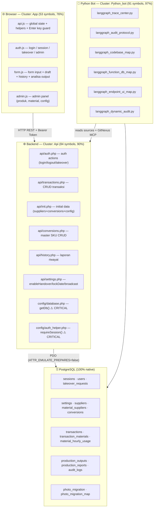

# Architecture Overview — ProdAdmin

**Jenis aplikasi:** Production Admin — sistem pencatatan produksi harian (shift, mesin, material, output)
**Stack:** PHP 8 + PostgreSQL (backend) · Vanilla JS + Bootstrap 5 (frontend) · Python + LangGraph (tooling)
**Last updated:** 2026-07-07 | **Index:** 1.812 nodes · 2.934 edges · 114 flows · 108 clusters

---

## High-Level Architecture



---

## Clusters

| Cluster | Symbols | Cohesion | Files | Catatan |
|---------|---------|----------|-------|---------|
| **App** | **53** | **76%** | `assets/app/api.js`, `auth.js`, `form.js`, `admin.js` | Naik dari 41→53 simbol setelah penambahan draft, fmtInt, parseIntField, refreshAnalysis, resetConversionModalBtn. Cohesion turun 93%→76% karena lebih banyak cross-function coupling |
| **Api** | 84 | 90% | `api/auth.php`, `api/transactions.php`, `api/history.php`, `api/settings.php`, `api/materials.php`, `api/admin.php`, `api/photos.php`, `api/init.php`, `api/conversions.php`, `api/config.php`, `config/database.php`, `config/auth_helper.php` | Stabil |
| **Python_bot** | 91 | 97% | `python_bot/langgraph_*.py`, `character_audit.py`, `db_config.py`, `langgraph_dynamic_audit.py` | Stabil |

> Catatan: Ada file conflict (`*_ASUSVIVO_May-26-*_Conflict.php`) yang merupakan duplikat dari Git conflict resolution. File ini tidak boleh dipakai di production — gunakan `api/auth.php` dan `api/transactions.php` versi utama.

---

## Database Schema (dari kode)

| Tabel | Isi |
|-------|-----|
| `users` | username, password_hash, role |
| `sessions` | token, username, machine_id, expires_at |
| `takeover_requests` | id, username, machine_id, requester_token, status, timeout_count, created_at, updated_at |
| `settings` | key (PK), value — LIST_MESIN, LIST_SIZE, LIST_ALIASES, LOCK_DATE, ADMIN_PIN, BROADCAST_MSG, BROADCAST_ACTIVE, ENABLE_HANDOVER |
| `suppliers` | material_name (PK), display_order |
| `material_suppliers` | material_name, supplier_name, display_order |
| `conversions` | mid (PK), item_name, cat_bag, cat_box, ratio (pcs/box), weight_grams — referensi SKU untuk analisa output |
| `transactions` | uuid, production_date, shift_id, machine_id, product_size, revision_count, created_by, status (DRAFT/FINAL/HISTORY/SUPERSEDED) |
| `transaction_materials` | per material: stock_initial, stock_in, stock_return, reject, production_amount, total_usage, stock_final, label_photos |
| `material_hourly_usage` | transaction_material_id, hour_idx (0-23), amount |
| `production_outputs` | uuid, mid, product_name, qty_box, category_bag, category_box, counter_pcs, total_weight_kg, loss_kg, revision_count, status (default `ACTIVE`) |
| `production_reports` | uuid, total_output_kg, total_loss_kg, avg_loss_pct, downtime_min, downtime_pct, speed_ppm, trouble_logs, near_miss, notes, reject_printing_kg |
| `audit_logs` | actor, action, details, timestamp |
| `photo_migration` | gdrive_id, local_path, mime_type, status, attempts |
| `photo_migration_map` | tm_id, gdrive_id, position |

---

## Execution Flow Categories (114 total)

| Category | Processes | Description |
|----------|-----------|-------------|
| Auth | SubmitLogin→*, ValidateExistingSession→*, ActionForceLogin→*, ActionValidate→* | Login, session, takeover |
| Transactions | ActionSubmit→*, ActionRevise→*, ActionFinalize→*, ActionDelete→* | CRUD laporan |
| History | RenderHistoryCards→* | Tampilkan & interaksi riwayat (incl. populateFormFromHistory) |
| Takeover | WaitForTakeover→* | Session takeover flow |
| Draft | RestoreDraft→*, CollectOutputs→*, SnapshotRows→* | Draft save/restore + analisa |
| Conversion | RenderConversionTable→* | Admin master produk |
| Submit payload | BuildSubmitPayload→* | Pengiriman data form |

## Status Lifecycle — Transactions

```
DRAFT ──(finalize)──► FINAL
  │                      │
  │(revise)              │(revise by admin)
  ▼                      ▼
HISTORY              HISTORY
  │
  │(delete — admin only)
  ▼
HISTORY   ← NB: delete JUGA set HISTORY, bukan SUPERSEDED

⚠️ SUPERSEDED tidak pernah di-SET oleh action manapun.
   Dipakai sebagai guard: WHERE status NOT IN ('HISTORY','SUPERSEDED')
```

---

Lihat diagram SVG: [diagrams/architecture.svg](diagrams/architecture.svg)
