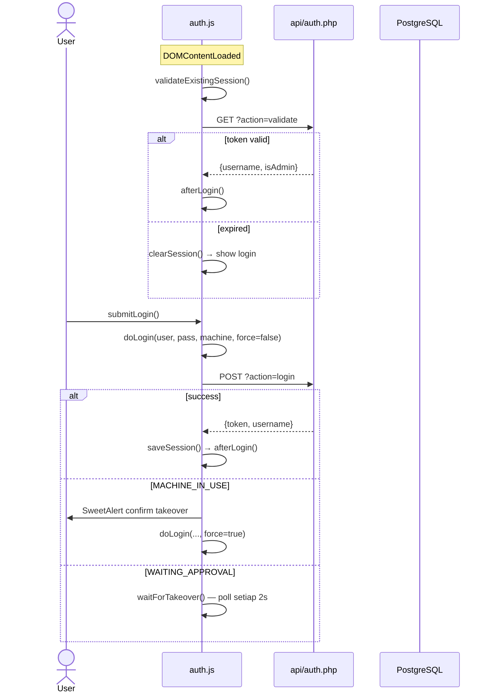

# Auth Flow — ProdAdmin

## Ringkasan

| Flow | Trigger | File |
|------|---------|------|
| Normal Login | User klik btnLogin | `auth.js:submitLogin → doLogin` |
| Session Restore | DOMContentLoaded | `auth.js:validateExistingSession` |
| Takeover Direct | force=true | `api/auth.php:actionForceLogin` |
| Takeover Approval | WAITING_APPROVAL | `auth.js:waitForTakeover` |
| Admin Mode | PIN prompt | `auth.js:enterAdminMode` |
| Logout | handleLogout | `api/auth.php:actionLogout` |

---

## State Management (localStorage)

| Key | Isi |
|-----|-----|
| `PROD3_TOKEN` | Bearer token |
| `PROD3_USER` | username |
| `PROD3_MACHINE` | machine ID |
| `PROD3_ADMIN` | `"1"` jika admin mode |
| `PROD3_THEME` | `"dark"` / `"light"` |

---

## Sequence Diagram

Lihat: [diagrams/auth-flow.svg](diagrams/auth-flow.svg)

---

## Key Functions

### `submitLogin()` — [assets/app/auth.js:286](../assets/app/auth.js#L286)
- **Input:** form `loginUserSelect`, `loginPasswordInput`, `loginMachineSelect`
- **Output:** call `doLogin()` atau toast error
- **Processes:** SubmitLogin→RawJson (6 steps), SubmitLogin→Toast (5 steps), SubmitLogin→UpdateUserBadge (4 steps)

### `doLogin(username, password, machine, isAdmin, force)` — [assets/app/auth.js:233](../assets/app/auth.js#L233)
- **Input:** credentials + machine + isAdmin flag + force flag
- **Output:** set `App.state.token`, `saveSession()`, `afterLogin()`
- **Edge cases:** MACHINE_IN_USE → rekursif dengan force=true | WAITING_APPROVAL → `waitForTakeover(u, tempToken, machine, isAdmin)` | FORCE_TAKEOVER_PROMPT
- **Blast radius:** LOW — 1 direct caller (submitLogin), 5 processes affected

### `validateExistingSession()` — [assets/app/auth.js:366](../assets/app/auth.js#L366)
- **Input:** `App.state.token` dari localStorage
- **Output:** `true` (session valid + afterLogin) atau `false` (clearSession)
- **Processes:** ValidateExistingSession→RawJson (5 steps), ValidateExistingSession→Toast (4 steps)

### `afterLogin()` — [assets/app/auth.js:85](../assets/app/auth.js#L85)
- Dipanggil setelah login berhasil (dari `doLogin`, `validateExistingSession`, `waitForTakeover`)
- Sequence: `updateUserBadge()` → `setAppVisible(true)` → `loadInitialData()` → `startTakeoverMonitor()`
- `loadInitialData()` melakukan: init.php → draft pre-load → renderMaterialTable → loadHistory → settings.php → triggerHandover (jika enabled)

### `enterAdminMode()` — [assets/app/auth.js:92](../assets/app/auth.js#L92)
- **Behavior:** Set `App.state.isAdmin = true` + `saveSession()` + `loadInitialData()` — **tidak ada API call**
- PIN verification dilakukan oleh `showAdminLogin()` (memanggil `api/admin.php?action=verifyAdmin`) **sebelum** `enterAdminMode` dipanggil

### `startTakeoverMonitor()` — [assets/app/auth.js:128](../assets/app/auth.js#L128)
- **Polling interval:** 5000ms (5 detik) via `setInterval`
- **Guard:** `clearInterval` existing monitor sebelum buat baru — aman dari double monitor
- **NB:** `waitForTakeover` (beda function) polling setiap 2s

### `createSession(db, username, machineId)` — [api/auth.php:89](../api/auth.php#L89)
- **Input:** PDO connection + user + machine
- **Output:** token string (bin2hex 32 bytes)
- **Side effects:** GC expired sessions + takeover_requests (DELETE inside transaction), INSERT sessions
- **Session TTL:** 6 jam (`SESSION_TTL_SEC = 21600`) via `NOW() + make_interval(secs => 21600)`
- **Callers:** `actionLogin`, `actionForceLogin`
